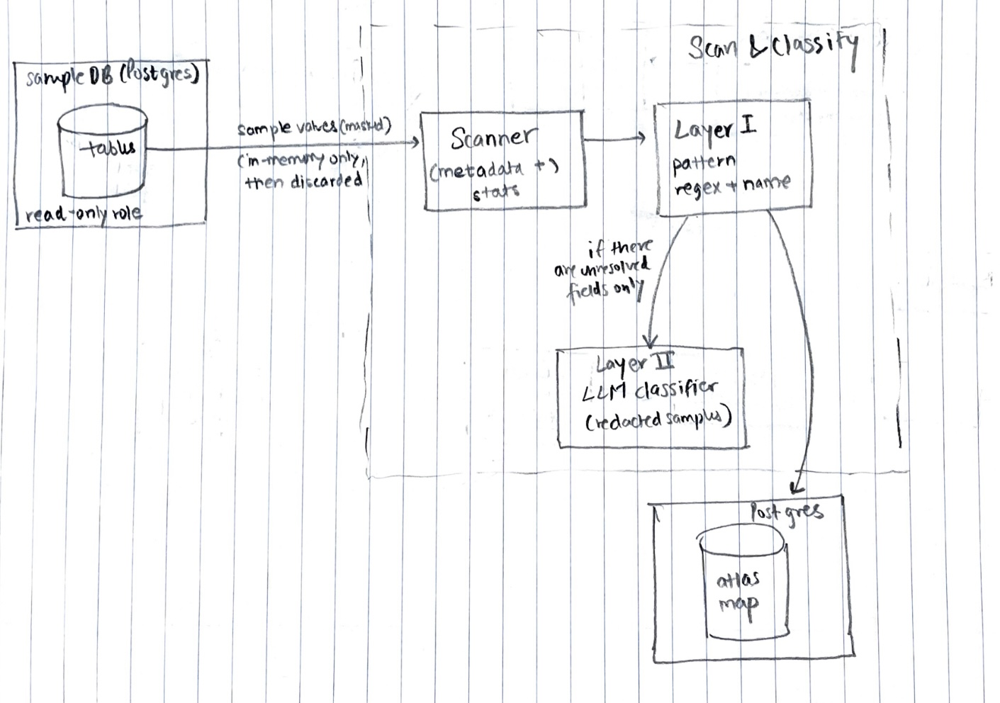
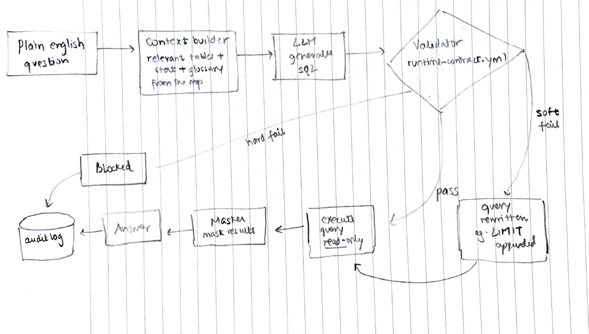

# pii-atlas

a metadata-only map of where the personal info lives in a company's systems. classified with measured accuracy, queryable in plain english and audtiable down to the model version.

### What it does:
- connects read-only to a db
- scans every table and col, building a metadata map (no actual values)
- classifies which fields contain personal info: deterministic patterns first and then LLM (if needed)
- answers plain english questions: every generated query is validated agains a policy contract before execution, PII in results will be masked and everything will be recorded in an audit table (the exact question, which contract was used, metadata versions etc.)

LLM never touches the db directly. 

### Architecture 

**Scan and Classification Pipeline**

 

**Query flow: validation, masking and audit**

